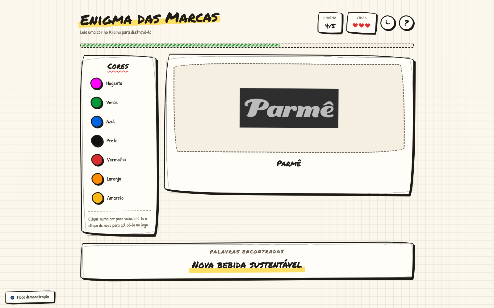

# Enigma das Marcas

Jogo interativo feito para o **IBMEC Day**. Cinco logos de marcas aparecem sem
cor na tela; a única forma de destravar cada cor da paleta é passar uma
amostra física de verdade no [Kroma](https://github.com/mgff01/Kroma), o
leitor de cores em ESP32 que acompanha o jogo. Arrastando a cor certa até o
logo, ele ganha cor — e ao colorir todos os cinco, uma frase escondida se
revela.



## Visão geral

O projeto tem duas partes que conversam por serial:

- **`firmware/Kroma`** — sketch para ESP32 (compila com PlatformIO ou Arduino
  IDE) que lê um sensor de cor TCS34725, classifica a leitura e manda o
  resultado pela serial, além de mostrar o status em um display OLED.
- **Servidor + navegador** — um servidor Node lê essa serial e repassa cada
  cor lida aos navegadores conectados via WebSocket; a página do jogo aplica
  as regras (vidas, enigmas, frase) e desenha a interface.

## Rodando

Requer Node.js 18 ou mais recente.

```bash
npm install
npm start
```

Depois abra <http://localhost:3000>.

### Sem a placa por perto

```bash
npm run mock
```

O modo demonstração gera cores sozinho, então dá para testar, apresentar e
desenvolver o jogo inteiro sem o hardware.

### Configuração

Tudo é controlado por variável de ambiente — não é preciso editar código para
trocar a porta serial de uma máquina para outra.

| Variável | Padrão | Para que serve |
| -------- | ------ | -------------- |
| `PORT` | `3000` | Porta HTTP do jogo |
| `SERIAL_PORT` | *(vazio)* | Porta da placa (`COM5`, `/dev/ttyUSB0`). Vazio = detectar sozinho |
| `BAUD_RATE` | `115200` | Velocidade da serial |
| `MOCK` | — | `1` liga o modo demonstração (equivale a `--mock`) |
| `MOCK_INTERVAL_MS` | `4000` | Intervalo entre cores no modo demonstração |
| `RECONNECT_MIN_MS` / `RECONNECT_MAX_MS` | `1000` / `15000` | Faixa do backoff de reconexão da serial |
| `LOG_LEVEL` | `info` | `debug` mostra cada linha recebida da serial |

Exemplo:

```bash
SERIAL_PORT=/dev/ttyUSB0 PORT=8080 npm start
```

Quando `SERIAL_PORT` não é informado, o servidor lista as portas do sistema e
escolhe a primeira cujo fabricante seja um conversor USB-serial conhecido
(CP210x, CH340, FTDI, USB nativo do ESP32, Arduino). Se a placa não estiver
ligada, ele fica tentando de novo com backoff exponencial e conecta sozinho
assim que ela aparecer — não é preciso reiniciar o servidor.

## Como jogar

1. Encoste uma amostra colorida no sensor do Kroma. A cor correspondente
   destrava na paleta, na tela.
2. Arraste a cor destravada até o logo — ou, pelo teclado/celular, selecione a
   cor e aperte <kbd>Enter</kbd> sobre o logo.
3. Cada logo pede uma ou duas cores específicas. Aplicar a cor errada custa
   uma vida; são três no total.
4. Com todos os logos coloridos, a frase completa aparece.

O botão <kbd>?</kbd> mostra uma dica geral do enigma.

### Painel do apresentador

<kbd>Ctrl</kbd> (ou <kbd>Cmd</kbd>) + <kbd>Alt</kbd> + <kbd>D</kbd> abre um
painel com o estado da conexão, a última leitura recebida e botões para
destravar cores manualmente. É a rede de segurança para quando o sensor falha
no meio de uma apresentação ao vivo.

## Estrutura

```
firmware/Kroma/    Firmware ESP32: sensor de cor + display OLED + protocolo serial
src/
  server.js        HTTP + WebSocket; junta a fonte de cores aos navegadores
  colorSource.js   leitura serial (com reconexão) e o gerador do modo demonstração
  protocol.js      parser do protocolo do Kroma (JSON Lines e formato antigo)
  config.js        variáveis de ambiente e argumentos de linha de comando
  logger.js        log com nível e horário
public/
  index.html
  css/styles.css
  js/config.mjs     conteúdo do jogo: paleta, enigmas, textos
  js/game.mjs       regras do jogo, sem DOM — o que os testes cobrem
  js/ui.mjs         tudo que toca na tela (DOM, drag-and-drop, painel do apresentador)
  js/connection.mjs cliente socket.io
  js/main.mjs       liga as três partes acima
server.js          atalho para src/server.js, para `node server.js` continuar funcionando
```

A separação entre `game.mjs` (regras) e `ui.mjs` (tela) é o ponto central da
organização do front-end: o motor do jogo não sabe nada de DOM, socket ou
timer — ele recebe uma ação e devolve o que aconteceu — o que permite testar
regras como "errar três vezes encerra a partida" sem precisar clicar na tela.

## Testes

```bash
npm test
```

Roda com `node --test` (sem dependências externas) e cobre o parser do
protocolo serial (linha truncada, cor desconhecida, formato antigo do
firmware), as regras do jogo (vidas, cor repetida, ordem das cores exigidas,
recomeço) e a subida do servidor, incluindo `/api/health`. O CI
(`.github/workflows/tests.yml`) roda essa mesma suíte a cada push e pull
request.

## Comunicação com a placa

O servidor lê a serial e repassa cada evento por WebSocket:

| Evento | Direção | Conteúdo |
| ------ | ------- | -------- |
| `color` | servidor → navegador | `{ name, hex, rgb, saturated, lux, receivedAt }` |
| `source-status` | servidor → navegador | `{ state, detail }` — `connected`, `searching`, `disconnected` ou `mock` |
| `device-message` | servidor → navegador | logs e status vindos do firmware |

`GET /api/health` devolve o mesmo estado em JSON — útil para conferir se a
placa está conectada sem precisar abrir o navegador.

O formato das linhas seriais (JSON Lines) está documentado em
[`docs/PROTOCOL.md`](https://github.com/mgff01/Kroma/blob/main/docs/PROTOCOL.md),
no repositório do Kroma. O firmware mais antigo, que mandava só o nome da cor
em texto puro, também continua funcionando como fallback.

## Firmware (Kroma)

```bash
pio run                # compila
pio run -t upload      # grava na placa
pio device monitor      # abre a serial em 115200 baud
```

O mesmo código também compila pela Arduino IDE, abrindo
`firmware/Kroma/Kroma.ino`. Dependências (resolvidas automaticamente pelo
PlatformIO): `Adafruit TCS34725` (sensor de cor) e `U8g2` (display OLED).

## Solução de problemas

| Sintoma | O que fazer |
| ------- | ----------- |
| "Kroma desconectado" | Confira o cabo. O servidor reconecta sozinho quando a placa voltar. |
| "Procurando a placa…" | Informe a porta explicitamente: `SERIAL_PORT=COM5 npm start`. |
| "abra pelo servidor (npm start)" | A página foi aberta como arquivo local. Use <http://localhost:3000>. |
| `EADDRINUSE` | Outro processo já usa a porta: `PORT=3001 npm start`. |
| Cores não destravam | Rode com `LOG_LEVEL=debug` e veja se as linhas chegam; o sensor pode precisar de calibração (comando `w` no firmware). |
| Logo aparece como texto | O site que hospeda a imagem saiu do ar; o jogo segue jogável com o nome da marca. |
